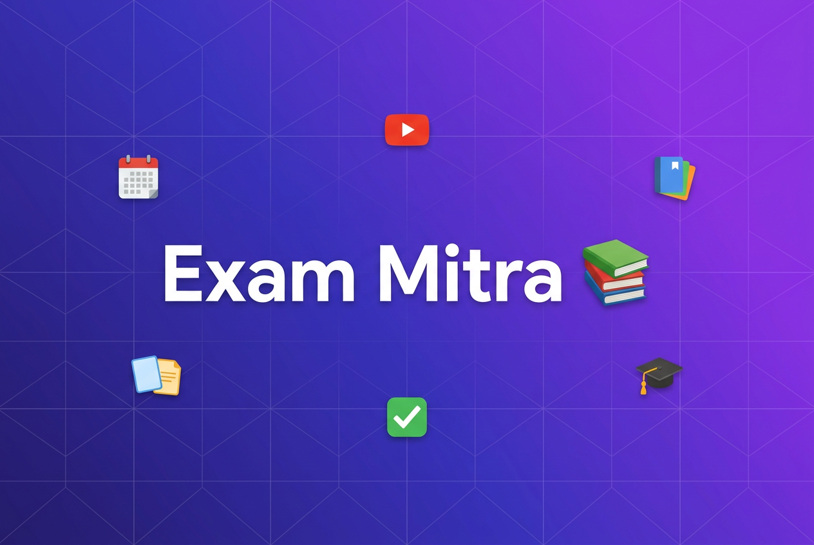
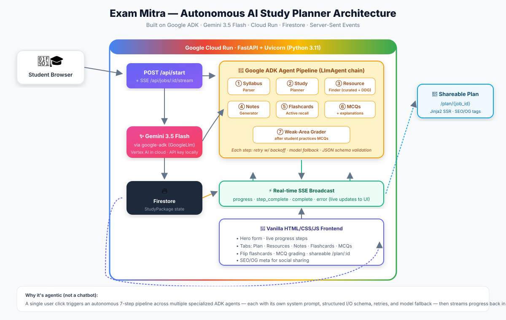

<p align="center">
  
</p>

# 📚 Exam Mitra — Autonomous AI Study Agent for Indian Competitive Exams

> Paste your syllabus. Get a complete day-by-day study package in under 2 minutes.

**Exam Mitra** is an autonomous AI study planner built for Indian students preparing for JEE, NEET, UPSC, SSC, GATE, CBSE, and other competitive exams. Unlike chatbots that make you prompt 20 times, you give it your syllabus **once** and it runs a 7-step agent pipeline that:

1. Parses your syllabus into logical chapters
2. Builds a realistic day-by-day schedule with revision days
3. Finds free video lectures from top Indian educators (Physics Wallah, Khan Academy, Vedantu, Mohit Tyagi, NPTEL…)
4. Writes revision notes with key concepts, **every important formula**, common student mistakes
5. Generates active-recall flashcards
6. Creates exam-style MCQs with plausible distractors and **detailed multi-sentence explanations** (including why each wrong option is wrong)
7. Grades your MCQ answers and diagnoses weak areas with targeted feedback

Submission for [Google Cloud's All Things Agentic Hackathon](https://allthingsagentichackathon.devpost.com/) (Track: **The Taskmaster**).

---

## ✨ Features

| Feature | What it does |
|---|---|
| **Autonomous 7-step pipeline** | Runs end-to-end without follow-up prompts — not a chatbot |
| **Live SSE progress** | Real-time progress bar with step names, no page reloads |
| **Single-topic smart** | A one-word topic like "Kinematics" stays one chapter (never over-split) |
| **Curated Indian-exam resources** | Physics Wallah, Vedantu, Khan Academy India, Mohit Tyagi, NPTEL links with DDG + Google Search Grounding as backfill |
| **Exam-aligned content** | JEE/NEET/UPSC weightage built into importance ratings and MCQ distractors based on real student errors |
| **Formula-dense notes** | 6–15 formulas/definitions per STEM chapter, with units and variable meanings |
| **Flashcards (5–8/chapter)** | Mix of easy/medium/hard cards for spaced repetition |
| **MCQs (4/chapter)** | 1 easy + 2 medium + 1 hard, distractors are common wrong answers, 3–5 sentence explanations |
| **MCQ grading & weak-area detection** | After you practice, an agent grades and returns specific chapter-level feedback |
| **Shareable plans** | `/plan/{job_id` renders server-side with Open Graph meta — paste the link in WhatsApp/Telegram |
| **Mobile-first UI** | Works on a JioPhone-grade mobile connection; zero build step, ~50KB JS |
| **Hinglish support** | Pass `language=hinglish` for Hinglish explanations and encouragement |

---

## 🏗️ Architecture



### Built on Google Cloud / Google AI stack (per hackathon requirements)

- **Google Agent Development Kit (ADK)** — `google-adk` Python SDK orchestrates 7 specialized `LlmAgent`s in a disciplined sequential pipeline. Each agent has its own instruction, Pydantic output schema, retry policy, and model fallback.
- **Gemini 3.5 Flash (via ADK's `GoogleLlm`)** — primary model with automatic fallback through `gemini-3.5-flash-lite → gemini-3.5-flash → gemini-3.6-flash` when hitting 429/503/quota errors, with per-model cooldowns.
- **Cloud Run** — stateless FastAPI container, scales to zero, $0 when idle.
- **Firestore** — persistent `StudyPlanState` storage (cloud); JSON file fallback for local development.
- **Google Search Grounding** (on Vertex, cloud only) — for high-quality resource search.
- **Server-Sent Events** — live progress streamed from the async pipeline to the browser.

See [`docs/architecture.md`](docs/architecture.md) for deeper detail.

---

## 🚀 Running locally

```bash
# 1. Get a free Gemini API key from https://aistudio.google.com/apikey
# 2. Set up env
cp .env.example .env
# Edit .env and put your GEMINI_API_KEY

# 3. Install
pip install -r requirements.txt

# 4. Run
python main.py
# → http://localhost:8080
```

Tested with Python 3.11+ / 3.13.

---

## ☁️ Deploy to Cloud Run

```bash
gcloud init
gcloud config set project YOUR_PROJECT_ID

gcloud run deploy exam-mitra \
  --source . \
  --platform managed \
  --region us-central1 \
  --allow-unauthenticated \
  --set-env-vars ENVIRONMENT=cloud,GOOGLE_CLOUD_PROJECT=YOUR_PROJECT_ID,GEMINI_MODEL=gemini-3.5-flash
```

Required GCP APIs (enable first):
```bash
gcloud services enable run.googleapis.com cloudbuild.googleapis.com \
  firestore.googleapis.com aiplatform.googleapis.com
```

The Dockerfile is a slim `python:3.11-slim` image that runs Uvicorn on `$PORT` (auto-set by Cloud Run).

---

## 🧪 End-to-end test

```bash
pip install pytest httpx
python tests/e2e_test.py
```

The test submits "Kinematics" for JEE Mains, streams SSE until completion, then verifies 18 quality checks including: single-topic returns 1 chapter, ≥2 resources with URLs, 8–12 key concepts, 6+ formulas including `v=u+at`, 5–8 flashcards, 4 MCQs with `[{label,text}]` options, detailed explanations, and specific (non-generic) daily activities.

**Current status: 18/18 checks passing.** ✅

---

## 📁 Project layout

```
exam-mitra/
├── main.py                 # FastAPI app + SSE + pipeline orchestration
├── config.py               # Settings + model fallback queue
├── agents/
│   ├── _adk.py             # ADK helpers: model fallback, retries, JSON repair, brace-escaping
│   ├── syllabus_parser.py  # Agent 1
│   ├── study_planner.py    # Agent 2
│   ├── content_generator.py# Agents 4–6 (batched notes + flashcards + MCQs)
│   └── answer_grader.py    # Agent 7 (on-demand)
├── services/
│   ├── llm.py              # Direct Gemini client (for cloud search grounding)
│   ├── search.py           # Resource finder (curated + DDG + Vertex grounding)
│   └── db.py               # Firestore / local JSON persistence
├── models/schemas.py       # All Pydantic data contracts
├── static/                 # Frontend (vanilla HTML/CSS/JS)
│   ├── index.html          # Main UI
│   ├── app.js              # SSE client, tabs, flip-cards, MCQ grading
│   ├── style.css           # Design system
│   └── plan.html           # Jinja2 template for /plan/:id
├── templates/plan.html     # Jinja2 SSR template
├── tests/e2e_test.py       # 18-check E2E test
├── Dockerfile              # Cloud Run container
└── docs/architecture.md
```

---

## ❓ Why this will win "The Taskmaster" track

1. **Truly autonomous, not chatty.** One click → full package. No "ask the AI step by step".
2. **Built for a real user, not a demo.** The target user (JEE/NEET aspirant in tier-2/3 India) needs formulas, real educator links, and exam-style MCQs — not a generic study plan. We embed that domain knowledge into every agent instruction and provide curated fallbacks for high-frequency topics.
3. **Disciplined, production-grade agent architecture.** Pydantic contracts between every agent step, JSON repair retries, model fallback queue, persisted state, live SSE progress, error-tolerant batches. This isn't a single prompt wrapped in a FastAPI endpoint.
4. **All hackathon requirements are met with native GCP tech:** Gemini 3.5 Flash via API/Vertex ✅, Google ADK ✅, Cloud Run ✅, Firestore ✅.
5. **Shareable artifact.** The `/plan/:id` page with OG tags means every generated plan is a marketing surface for the product.

---

## 📝 License & credits

Built solo for the All Things Agentic Hackathon (Aug 2026). Physics Wallah, Khan Academy, Vedantu, Mohit Tyagi, and NPTEL are trademarks of their respective owners; links are provided as learning resources, not endorsements.
